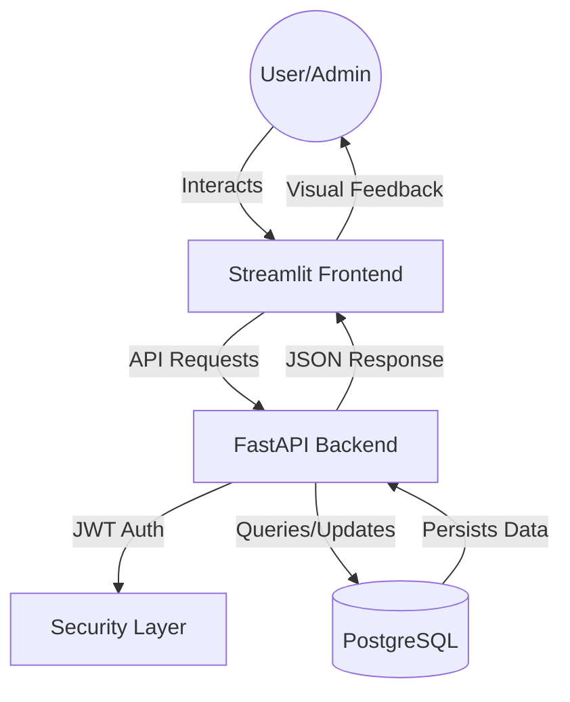

# 📘 Bookit: Async Booking Service

> A full-stack, containerized resource scheduling system built with **FastAPI**, **Streamlit**, and **PostgreSQL**.

[](https://www.python.org/)
[](https://fastapi.tiangolo.com/)
[](https://streamlit.io/)
[](https://www.docker.com/)

## 🏗️ Architecture

Bookit is designed as a microservice-ready application that handles concurrent booking requests without race conditions.

* **Backend:** FastAPI (Async) with SQLAlchemy 2.0 & Pydantic v2.
* **Database:** PostgreSQL (Production-grade RDBMS).
* **Frontend:** Streamlit (Interactive Dashboard).
* **Infrastructure:** Fully Dockerized with `docker-compose`.



## ✨ Key Features

* **🔒 Secure Authentication:** JWT-based login and signup flows.
* **👑 Role-Based Access Control (RBAC):**
    * **Admins:** Create/Manage resources (Rooms, Equipment).
    * **Users:** Book resources and view personal history.
* **🛡️ Conflict Prevention:** Uses ACID database transactions to prevent double-booking (Race Conditions).
* **⚡ Real-time Feedback:** Instant success/error messages for booking status.

---

## 🚀 Getting Started

You can run the entire system with a single command.

### Prerequisites
* [Docker Desktop](https://www.docker.com/products/docker-desktop/) installed and running.

### Installation

1.  **Clone the repository:**
    ```bash
    git clone [https://github.com/hruthikchauhan07/async-booking-service.git](https://github.com/hruthikchauhan07/async-booking-service.git)
    cd async-booking-service
    ```

2.  **Run with Docker Compose:**
    ```bash
    docker compose up --build
    ```

The services will start automatically.

---

## 🖥️ Usage

### 1. Access the Frontend (Streamlit)
Go to: **[http://localhost:8501](http://localhost:8501)**

* **Sign Up:** Create a new account.
* **Login:** Access the dashboard.
* **Admin Panel:** Visible only to Superusers.

### 2. Access the API Docs (Swagger UI)
Go to: **[http://localhost:8000/docs](http://localhost:8000/docs)**

* Test API endpoints directly.
* View schemas and authentication methods.

---

## 🛠️ Admin Setup (First Time)

By default, new users are **Standard Users**. To promote yourself to **Admin**:

1.  Sign up via the Frontend.
2.  Access the database container or use **pgAdmin**.
3.  Run this SQL command:
    ```sql
    UPDATE "user" SET is_superuser = true WHERE email = 'your-email@example.com';
    ```
4.  Logout and Login again to see the **Admin Panel**.

---

## 📂 Project Structure

```bash
.
├── app/                # FastAPI Backend
│   ├── api/            # Route handlers (v1)
│   ├── core/           # Config & Security
│   ├── db/             # Database session & Base models
│   ├── models/         # SQLAlchemy Models
│   ├── schemas/        # Pydantic Schemas
│   └── main.py         # Entry point
├── frontend/           # Streamlit Frontend
│   └── fmain.py        # Dashboard Logic
├── alembic/            # Database Migrations
├── docker-compose.yml  # Container Orchestration
└── Dockerfile          # Backend Image Build
```

## 🤝 Contributing
Pull requests are welcome. For major changes, please open an issue first to discuss what you would like to change.
